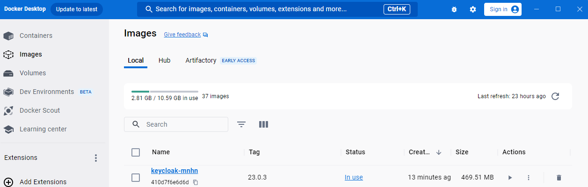
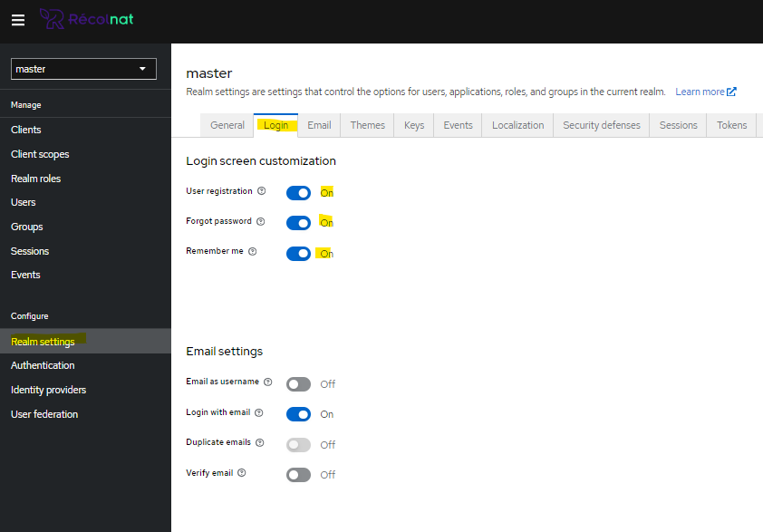
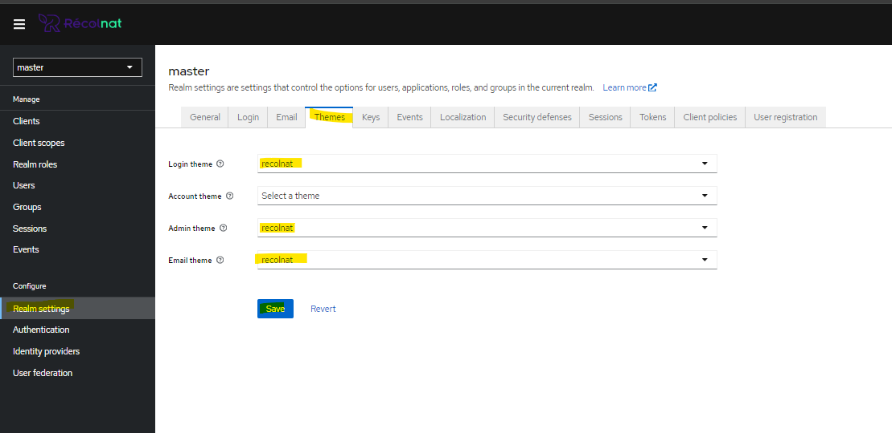

  
## Customisation Keycloak   
    
Structure keycloak extraite de la version 23.0.3    :

>Vous pouvez modifier les  css et les freemarkers (ftl), ainsi que les properties. Et, ceci selon vos besoins de customisation, sur les parties keycloak correspondant au : login, email et admin .
    
>Pour visualiser,localement, vos modifcations, faites:   
>>``` mvn clean install -Pgeneratelocal  ```

>Ceci va produire une image dans votre Docker Desktop   

>    

> Vous pourrez ensuite 'lancer' l'image soit:   
>- via la commande, avec docker compose:   

>>```  docker compose up -d    ```

>- via la commande docker :   

>>``` docker run --name keycloak_test -p 8089:8080  -e KEYCLOAK_ADMIN=admin -e KEYCLOAK_ADMIN_PASSWORD=admin   keycloak-mnhn:23.0.3   start-dev   ``` 

>Pour visualiser vos customisations, allez sur http://localhost:8089      

>Connectez-vous avec (admin, admin), puis changez le paramétrage suivant et reconnectez-vous:   

>
>


>Remarque: Pour arrêter, relancer ou supprimer le container (lancé à partir du docker compose):   

>>```  docker compose stop  |  docker compose start   |  docker compose down     ```

>Pour arrêter, relancer ou supprimer le container (lancé à partir de la commande docker):   

>>```  docker container stop keycloak_test ou docker kill keycloak_test  | docker container start keycloak_test  | docker container rm -f keycloak_test```

>Pour supprimer l'image:    

>>```  docker rmi keycloak-mnhn:23.0.3```
   
    
## documentation   
> :warning: **(doc partielle, en cours)**       
   
>   